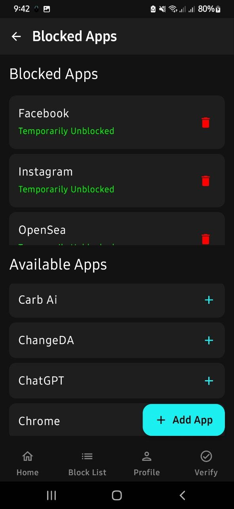
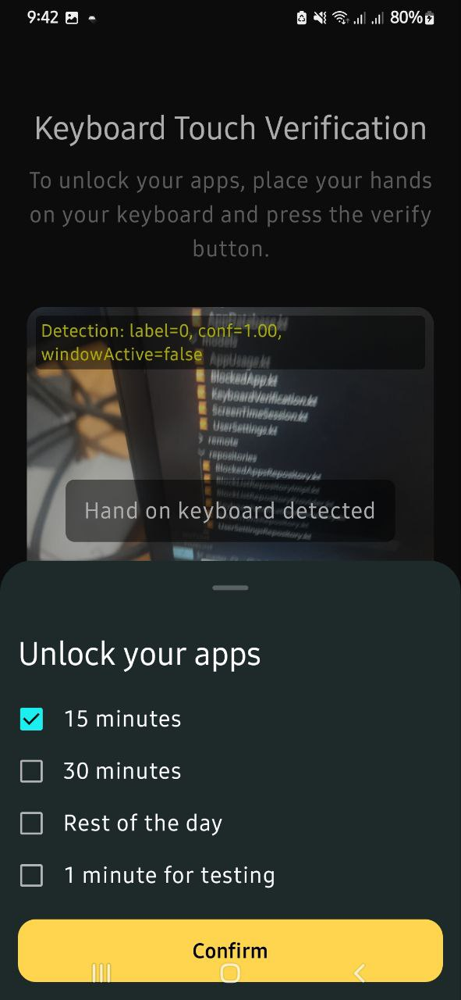
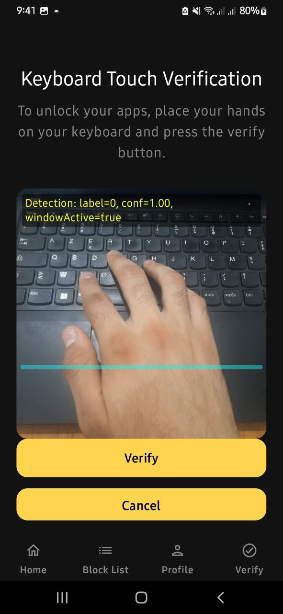
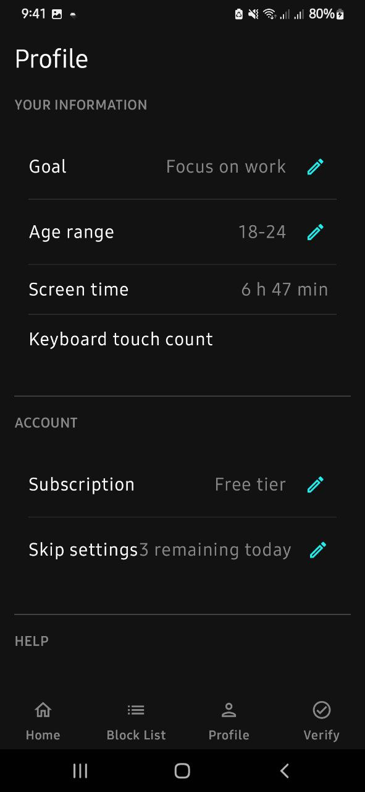

# 🛘 TouchKeyboard2 – Digital Wellbeing & App Blocking Keyboard for Android

A **privacy-first Android app** that empowers users to manage screen time, block distracting apps, and track device usage with a custom keyboard overlay.

---

## 📌 Description

TouchKeyboard2 helps users take control of their digital habits. It combines a custom keyboard overlay with robust app-blocking and usage-tracking features.

The app allows users to:
- Set digital wellbeing goals
- Block selected distracting apps
- Visualize screen time and app usage stats
- Enforce focus through Android accessibility and overlay services

Built with **Jetpack Compose** and **MVVM**, it delivers a smooth onboarding experience and clean UI.

---

## 🧭 User Flow

1. **Onboarding**: Set goals and grant permissions.
2. **App Blocking**: Choose apps to block; restrictions are enforced via accessibility and overlays.
3. **Usage Tracking**: View daily screen time and app usage data.
4. **Profile & Settings**: Adjust preferences and manage blocked apps.

---

## ✨ Features

✅ **Custom Keyboard Overlay** – Monitors and restricts usage  
🔐 **App Blocking** – Enforced via accessibility + overlay services  
📱 **Screen Time Tracking** – Displays daily app usage  
📊 **Usage Charts** – Visual and interactive statistics  
✅ **Onboarding Flow** – Guides through setup and permissions  
🔐 **Permission Management** – Usage stats, overlays, accessibility  
✅ **Profile Management** – Track goals and adjust settings  
💾 **Local Data Storage** – Persistent storage with Room  
⚙️ **Background Services** – Active even outside the app  

---

## 📸 Screenshots

### 🖼️ Markdown Preview:

```





```

### 🖼️ HTML Gallery:

<div align="center">
  
  
  
  
  
</div>

---

## 🎥 Demo Video

[📽️ Watch Demo Video](app/src/main/java/com/example/touchkeyboard/Screenshots/video_2025-07-20_21-54-15.mp4)

---

## 🛠️ Tech Stack

- **Languages**: Kotlin  
- **Frameworks**: Jetpack Compose, AndroidX, Room (SQLite)  
- **Architecture**: MVVM (Model-View-ViewModel)  
- **Core Android APIs**: Accessibility Service, Usage Stats, Overlay Permissions, WorkManager  
- **Tools**: Gradle, ProGuard, DataStore  

---


## 🧠 What I Learned / Challenges Solved

Developing TouchKeyboard2 taught me how to handle **Android’s complex permission model**, build persistent **background services**, and implement **modern UI** with Jetpack Compose. I overcame challenges around **real-time usage tracking**, **app restriction enforcement**, and **smooth onboarding UX**, all within a clean **MVVM architecture** using Room for local storage.

---

