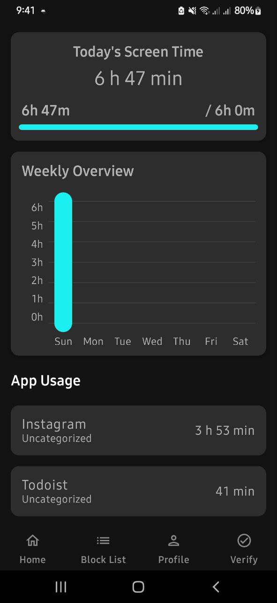

#  TouchKeyboard – AI-Powered App Blocking & Digital Wellbeing for Android

A privacy-first Android app that blocks distractions until you prove you’re working—using your phone’s camera and on-device AI.

---

## 📌 Description

TouchKeyboard is a digital wellbeing app that helps users reclaim focus and manage screen time by blocking selected apps—until the user verifies, via their phone camera, that their hand is placed on a real PC or laptop keyboard. This verification uses an on-device TensorFlow Lite model for privacy and speed.

### How it works:
- Users select distracting apps to block.
- When a blocked app is launched, the app overlays a lock screen.
- To unlock, the user must perform a verification: place their hand on their physical keyboard and show it to their phone’s camera.
- The app uses a custom-trained TensorFlow Lite model (see /assets/model.tflite) to detect the hand-on-keyboard gesture.
- Upon successful verification, the user can select a temporary unlock duration (e.g., 15/30 minutes, rest of day).
- All enforcement is local, privacy-respecting, and works even in the background.

---

## 🧭 User Flow

1. **Onboarding**: Set digital wellbeing goals and grant permissions (usage stats, overlays, accessibility).
2. **App Blocking**: Choose which apps to block; enforcement is automatic.
3. **Unlock via Verification**: When a blocked app is accessed, the user must verify by showing their hand on a keyboard to the phone camera.
4. **Temporary Unlock**: Upon successful verification, select how long to unlock the app(s).
5. **Usage Tracking**: Visualize daily app usage and screen time.
6. **Profile & Settings**: Adjust preferences, review progress, and manage blocked apps.

---

## ✨ Features

✅ **AI-Powered Verification** – Uses TensorFlow Lite to detect a hand on a physical keyboard via the phone camera  
🔐 **App Blocking** – Block selected apps until successful verification  
📱 **Temporary Unlock** – User chooses unlock duration after verification (15/30 min, rest of day, etc.)  
📊 **Screen Time Tracking** – Collects and displays detailed app usage and screen time statistics  
✅ **Onboarding Flow** – Guides users through permissions and goal-setting  
🔐 **Permission Management** – Handles all required Android permissions (usage stats, overlays, accessibility)  
✅ **Profile Management** – View and update user settings and digital wellbeing goals  
💾 **Local Data Storage** – Uses Room database for reliable, local data storage  
⚙️ **Background Services** – Enforces app blocking and tracks usage even when the app is not in the foreground  

---

## 📸 Screenshots

  
  
  
  
  

---

## 🎥 Demo Video

[📽️ Watch Demo Video](app/src/main/java/com/example/touchkeyboard/Screenshots/video_2025-07-20_21-54-15.mp4)

---

## 🛠️ Tech Stack

- **Languages**: Kotlin  
- **Frameworks**: Jetpack Compose, AndroidX, Room (SQLite)  
- **Architecture**: MVVM (Model-View-ViewModel)  
- **AI/ML**: TensorFlow Lite (on-device hand-on-keyboard detection)  
- **Core Android APIs**: Accessibility Service, Usage Stats, Overlay Permissions, WorkManager  
- **Tools**: Gradle, ProGuard, DataStore  

---

## 🧠 What I Learned / Key Challenges Solved

Developing TouchKeyboard required integrating on-device machine learning (TensorFlow Lite) with Android’s permission and background service model. I engineered a robust, privacy-respecting verification flow that uses the phone camera and a custom AI model to ensure users are actually working before granting access to blocked apps. Overcoming challenges in real-time camera processing, permission handling, and seamless user experience deepened my expertise in Android development, modern UI with Jetpack Compose, and practical ML deployment.

---

